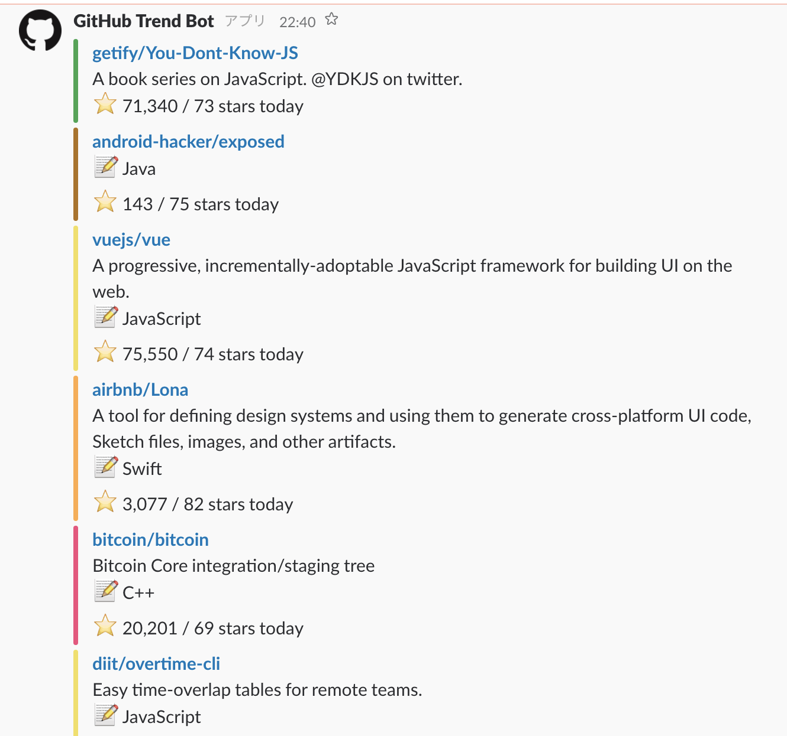

# GithubTrendBot

This bot regularly posts [Github trend](https://github.com/trending) to slack



## usage

**1. install**

```
git clone https://github.com/tamanugi/github_trend_bot
cd github_trend_bot 
mix deps.get 
```

**2. Config for Slack**

Edit `config/config.exs`.  
If you do not have a token,  
please get it from https://api.slack.com/custom-integrations/legacy-tokens

```elixir
config :slack,
  api_token: "enter your app token",
  channel: "enter channel name",
  option: %{username: "GitHub Trend Bot"}
```

**3. Start**

Enter this command.

```
mix run --no-halt
```

if you wanna test to post, use iex

```
iex -S mix
iex(1)> GithubTrendBot.post_trend
```

**4. Other**

config post schedule
https://github.com/c-rack/quantum-elixir

```elixir
config :quantum, GithubTrendBot.Scheduler,
  jobs: [
    {"0 * * * *", {GithubTrendBot, :post_trend, []}}
  ]
```